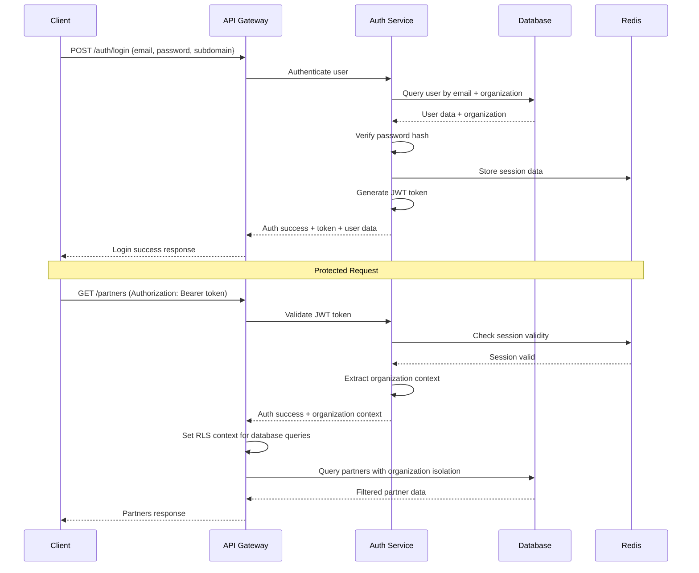

# Backend Architecture

## Service Architecture

### Function Organization
```
src/
├── controllers/
│   ├── authController.ts
│   ├── configurationController.ts
│   ├── partnerController.ts
│   ├── opportunityController.ts
│   └── dashboardController.ts
├── services/
│   ├── authService.ts
│   ├── configurationService.ts
│   ├── partnerService.ts
│   ├── opportunityService.ts
│   ├── commissionService.ts
│   └── dashboardService.ts
├── middleware/
│   ├── authentication.ts
│   ├── authorization.ts
│   ├── organizationContext.ts
│   ├── validation.ts
│   └── errorHandler.ts
├── models/
│   ├── Configuration.ts
│   ├── Partner.ts
│   ├── Opportunity.ts
│   └── User.ts
├── repositories/
│   ├── configurationRepository.ts
│   ├── partnerRepository.ts
│   ├── opportunityRepository.ts
│   └── userRepository.ts
├── utils/
│   ├── database.ts
│   ├── redis.ts
│   ├── validation.ts
│   └── logger.ts
└── routes/
    ├── auth.ts
    ├── configurations.ts
    ├── partners.ts
    ├── opportunities.ts
    └── dashboard.ts
```

### Controller Template
```typescript
import { Request, Response, NextFunction } from 'express';
import { ConfigurationService } from '../services/configurationService';
import { validateConfiguration } from '../utils/validation';
import { AuthenticatedRequest } from '../types/auth';

export class ConfigurationController {
  private configurationService: ConfigurationService;

  constructor() {
    this.configurationService = new ConfigurationService();
  }

  async getConfigurations(req: AuthenticatedRequest, res: Response, next: NextFunction) {
    try {
      const { organizationId } = req.user!;
      const { category } = req.query;

      const configurations = await this.configurationService.getConfigurations(
        organizationId,
        category as string
      );

      res.json(configurations);
    } catch (error) {
      next(error);
    }
  }

  async updateConfiguration(req: AuthenticatedRequest, res: Response, next: NextFunction) {
    try {
      const { organizationId } = req.user!;
      const configurationData = { ...req.body, organizationId };

      // Validate configuration data
      const validationResult = await validateConfiguration(configurationData);
      if (!validationResult.valid) {
        return res.status(400).json({ error: 'Invalid configuration', details: validationResult.errors });
      }

      const configuration = await this.configurationService.updateConfiguration(configurationData);

      res.status(201).json(configuration);
    } catch (error) {
      next(error);
    }
  }

  async getConfigValue(req: AuthenticatedRequest, res: Response, next: NextFunction) {
    try {
      const { organizationId } = req.user!;
      const { category, key } = req.params;
      const { defaultValue } = req.query;

      const value = await this.configurationService.getConfigValue(
        organizationId,
        category,
        key,
        defaultValue
      );

      res.json({ value });
    } catch (error) {
      next(error);
    }
  }
}
```

## Database Architecture

### Schema Design
```sql
-- Configuration-first schema already defined above in Database Schema section
-- Key points for backend architecture:

-- 1. Row Level Security (RLS) for multi-tenant isolation
-- 2. JSONB columns for flexible configuration storage
-- 3. Indexed queries for performance optimization
-- 4. Foreign key constraints for data integrity
-- 5. Audit trails for configuration changes
```

### Data Access Layer
```typescript
import { Pool, PoolClient } from 'pg';
import { Redis } from 'ioredis';
import { Configuration } from '../types';

export class ConfigurationRepository {
  private db: Pool;
  private cache: Redis;

  constructor(db: Pool, cache: Redis) {
    this.db = db;
    this.cache = cache;
  }

  async findByOrganizationAndCategory(
    organizationId: string,
    category?: string
  ): Promise<Configuration[]> {
    const cacheKey = `configs:${organizationId}:${category || 'all'}`;

    // Check cache first
    const cached = await this.cache.get(cacheKey);
    if (cached) {
      return JSON.parse(cached);
    }

    // Query database with RLS context
    const client = await this.db.connect();
    try {
      // Set organization context for RLS
      await client.query('SELECT set_config($1, $2, true)', [
        'app.current_organization_id',
        organizationId
      ]);

      const query = category
        ? 'SELECT * FROM configurations WHERE category = $1 ORDER BY key'
        : 'SELECT * FROM configurations ORDER BY category, key';

      const params = category ? [category] : [];
      const result = await client.query(query, params);

      const configurations = result.rows.map(this.mapRowToConfiguration);

      // Cache result for 5 minutes
      await this.cache.setex(cacheKey, 300, JSON.stringify(configurations));

      return configurations;
    } finally {
      client.release();
    }
  }

  async upsert(configuration: Partial<Configuration>): Promise<Configuration> {
    const client = await this.db.connect();
    try {
      await client.query('SELECT set_config($1, $2, true)', [
        'app.current_organization_id',
        configuration.organizationId
      ]);

      const query = `
        INSERT INTO configurations (
          organization_id, category, key, value, default_value,
          data_type, is_required, validation_rules
        ) VALUES ($1, $2, $3, $4, $5, $6, $7, $8)
        ON CONFLICT (organization_id, category, key)
        DO UPDATE SET
          value = EXCLUDED.value,
          data_type = EXCLUDED.data_type,
          is_required = EXCLUDED.is_required,
          validation_rules = EXCLUDED.validation_rules,
          updated_at = NOW()
        RETURNING *
      `;

      const params = [
        configuration.organizationId,
        configuration.category,
        configuration.key,
        JSON.stringify(configuration.value),
        configuration.defaultValue ? JSON.stringify(configuration.defaultValue) : null,
        configuration.dataType,
        configuration.isRequired || false,
        configuration.validationRules ? JSON.stringify(configuration.validationRules) : null
      ];

      const result = await client.query(query, params);

      // Invalidate cache
      const cachePattern = `configs:${configuration.organizationId}:*`;
      const keys = await this.cache.keys(cachePattern);
      if (keys.length > 0) {
        await this.cache.del(...keys);
      }

      return this.mapRowToConfiguration(result.rows[0]);
    } finally {
      client.release();
    }
  }

  private mapRowToConfiguration(row: any): Configuration {
    return {
      id: row.id,
      organizationId: row.organization_id,
      category: row.category,
      key: row.key,
      value: row.value,
      defaultValue: row.default_value,
      dataType: row.data_type,
      isRequired: row.is_required,
      validationRules: row.validation_rules,
      createdAt: row.created_at,
      updatedAt: row.updated_at
    };
  }
}
```

## Authentication and Authorization

### Auth Flow


### Middleware/Guards
```typescript
import { Request, Response, NextFunction } from 'express';
import jwt from 'jsonwebtoken';
import { Redis } from 'ioredis';
import { AuthenticatedRequest, JWTPayload } from '../types/auth';

export class AuthenticationMiddleware {
  private cache: Redis;
  private jwtSecret: string;

  constructor(cache: Redis, jwtSecret: string) {
    this.cache = cache;
    this.jwtSecret = jwtSecret;
  }

  authenticate = async (req: AuthenticatedRequest, res: Response, next: NextFunction) => {
    try {
      const authHeader = req.headers.authorization;
      if (!authHeader || !authHeader.startsWith('Bearer ')) {
        return res.status(401).json({ error: 'Missing or invalid authorization header' });
      }

      const token = authHeader.substring(7);

      // Verify JWT token
      const decoded = jwt.verify(token, this.jwtSecret) as JWTPayload;

      // Check if session exists in Redis
      const sessionKey = `session:${decoded.userId}:${decoded.organizationId}`;
      const sessionData = await this.cache.get(sessionKey);

      if (!sessionData) {
        return res.status(401).json({ error: 'Session expired' });
      }

      const session = JSON.parse(sessionData);

      // Attach user context to request
      req.user = {
        id: decoded.userId,
        organizationId: decoded.organizationId,
        email: decoded.email,
        role: decoded.role,
        permissions: session.permissions
      };

      next();
    } catch (error) {
      if (error instanceof jwt.JsonWebTokenError) {
        return res.status(401).json({ error: 'Invalid token' });
      }
      next(error);
    }
  };

  authorize = (requiredPermission: string) => {
    return (req: AuthenticatedRequest, res: Response, next: NextFunction) => {
      if (!req.user) {
        return res.status(401).json({ error: 'Authentication required' });
      }

      const { permissions } = req.user;

      if (!permissions[requiredPermission]) {
        return res.status(403).json({
          error: 'Insufficient permissions',
          required: requiredPermission
        });
      }

      next();
    };
  };

  setOrganizationContext = async (req: AuthenticatedRequest, res: Response, next: NextFunction) => {
    if (!req.user) {
      return next();
    }

    // Set organization context for Row Level Security
    req.organizationContext = req.user.organizationId;

    next();
  };
}
```
