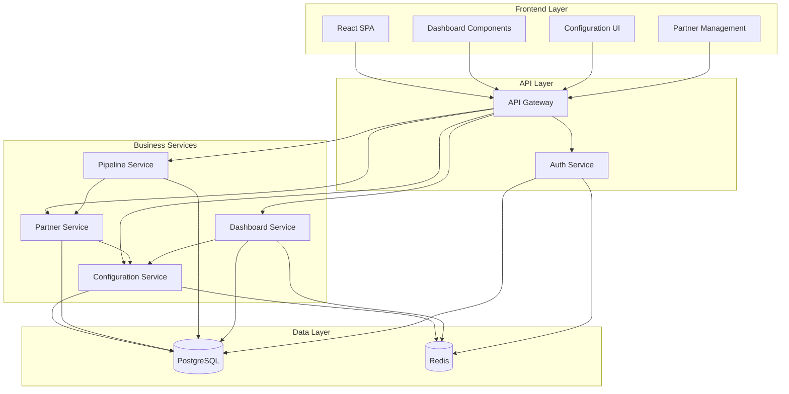

# Components

## Configuration Service

**Responsibility**: Manages all configuration data with tenant isolation, validation, and caching for optimal performance

**Key Interfaces**:
- GET /configurations - Retrieve configurations by category with inheritance resolution
- POST /configurations - Create/update configuration with validation
- GET /configurations/schema - Return configuration schema for admin UI generation

**Dependencies**: PostgreSQL for persistence, Redis for configuration caching, ValidationService for schema validation

**Technology Stack**: Express.js middleware with JSON Schema validation, Redis TTL caching, PostgreSQL JSONB queries

## Partner Management Service

**Responsibility**: Handles partner lifecycle, commission structure management, and relationship health calculations with full configurability

**Key Interfaces**:
- CRUD operations for partners with commission structure validation
- Commission calculation engine with configurable rules
- Relationship health scoring based on configurable metrics

**Dependencies**: Configuration Service for commission rules, Database for partner data, EventService for relationship updates

**Technology Stack**: Express.js routes with TypeScript validation, custom commission calculation engine, PostgreSQL with JSONB for flexible partner data

## Pipeline Management Service

**Responsibility**: Manages opportunity lifecycle with configurable pipeline stages, probability calculations, and forecasting

**Key Interfaces**:
- Opportunity CRUD with stage progression validation
- Pipeline analytics and forecasting with configurable parameters
- Stage transition workflows with configurable approval rules

**Dependencies**: Configuration Service for pipeline stages, Partner Service for commission calculations, User Service for assignments

**Technology Stack**: Express.js with state machine pattern for stage transitions, PostgreSQL for opportunity data, Redis for real-time pipeline updates

## Dashboard Service

**Responsibility**: Aggregates data from all services to provide executive-level KPIs and team performance metrics with configurable dashboards

**Key Interfaces**:
- Real-time KPI calculation with configurable metrics
- Team performance aggregation with configurable goals
- Revenue forecasting with configurable targets and timelines

**Dependencies**: All business services for data aggregation, Configuration Service for KPI definitions, WebSocket for real-time updates

**Technology Stack**: Express.js with complex aggregation queries, Redis for dashboard caching, WebSocket.io for real-time updates, configurable report generation

## Authentication & Authorization Service

**Responsibility**: Multi-tenant authentication with configurable role-based access control and organization isolation

**Key Interfaces**:
- JWT-based authentication with organization context
- Role-based authorization with configurable permissions
- Organization user management with configurable user limits

**Dependencies**: User Service for user data, Configuration Service for role definitions, Redis for session management

**Technology Stack**: Express.js with JWT middleware, bcrypt for password hashing, Redis for session storage, configurable RBAC system

## Component Diagrams

