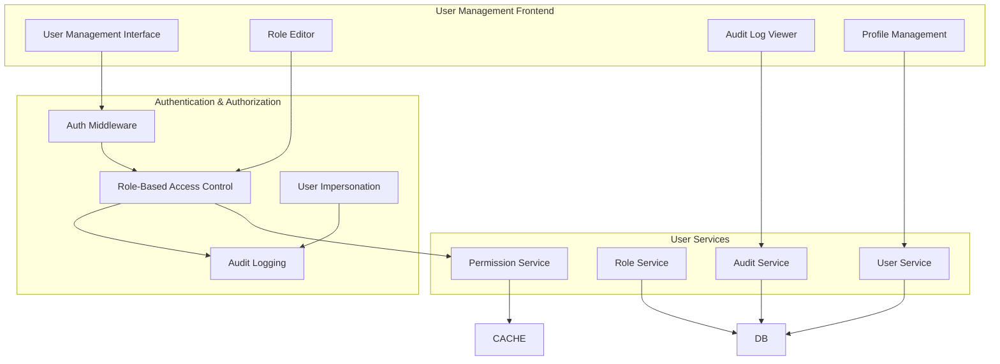

# Components

## Epic 7: Executive Design System Components

### Design Token Service

**Responsibility**: Manages executive-class design tokens, theme switching, and personalization settings with real-time updates

**Key Interfaces**:
- Theme management API with light/dark/high-contrast modes
- Design token API for consistent styling across components
- User preference persistence and synchronization
- Real-time theme updates via WebSocket

**Dependencies**: User Service for preference storage, WebSocket for real-time updates, Redis for theme caching

**Technology Stack**: CSS custom properties, React Context API, TypeScript theme definitions, Redis caching

### Executive Dashboard Service

**Responsibility**: Provides sophisticated data visualization with interactive charts, real-time updates, and executive-level analytics

**Key Interfaces**:
- Real-time KPI widgets with Chart.js integration
- Interactive data visualization with D3.js components
- Executive dashboard layout management
- Export functionality for presentations

**Dependencies**: All business services for data, Chart.js/D3.js for visualization, WebSocket for real-time updates

**Technology Stack**: Chart.js 4.x with custom themes, D3.js for advanced visualizations, Canvas API for performance, Framer Motion for animations

### Advanced Visualization Service

**Responsibility**: Handles complex business analytics with interactive charts, drill-down capabilities, and custom visualization builder

**Key Interfaces**:
- Interactive pipeline funnel with drill-down
- Revenue forecasting with multiple scenarios
- Partner relationship heatmaps and geographic visualization
- Custom chart builder for ad-hoc analysis

**Dependencies**: Business data services, Chart.js/D3.js libraries, Export service for chart rendering

**Technology Stack**: D3.js for custom visualizations, MapBox for geographic data, Chart.js for standard charts, Canvas API for performance optimization

### Navigation & Layout Service

**Responsibility**: Manages sophisticated navigation systems, multi-level menus, global search, and customizable layouts

**Key Interfaces**:
- Multi-level navigation with contextual breadcrumbs
- Global search across all platform data
- Customizable dashboard layouts with drag-and-drop
- Keyboard shortcuts and accessibility features

**Dependencies**: Search indexing service, User preferences, Layout persistence

**Technology Stack**: React Router v6, Fuse.js for search, CSS Grid/Flexbox, React DnD for layout customization

## Core Business Components

### Configuration Service

**Responsibility**: Manages all configuration data with tenant isolation, validation, and caching for optimal performance

**Key Interfaces**:
- GET /configurations - Retrieve configurations by category with inheritance resolution
- POST /configurations - Create/update configuration with validation
- GET /configurations/schema - Return configuration schema for admin UI generation

**Dependencies**: PostgreSQL for persistence, Redis for configuration caching, ValidationService for schema validation

**Technology Stack**: Express.js middleware with JSON Schema validation, Redis TTL caching, PostgreSQL JSONB queries

## Partner Management Service

**Responsibility**: Handles partner lifecycle, commission structure management, and relationship health calculations with full configurability

**Key Interfaces**:
- CRUD operations for partners with commission structure validation
- Commission calculation engine with configurable rules
- Relationship health scoring based on configurable metrics

**Dependencies**: Configuration Service for commission rules, Database for partner data, EventService for relationship updates

**Technology Stack**: Express.js routes with TypeScript validation, custom commission calculation engine, PostgreSQL with JSONB for flexible partner data

## Pipeline Management Service

**Responsibility**: Manages opportunity lifecycle with configurable pipeline stages, probability calculations, and forecasting

**Key Interfaces**:
- Opportunity CRUD with stage progression validation
- Pipeline analytics and forecasting with configurable parameters
- Stage transition workflows with configurable approval rules

**Dependencies**: Configuration Service for pipeline stages, Partner Service for commission calculations, User Service for assignments

**Technology Stack**: Express.js with state machine pattern for stage transitions, PostgreSQL for opportunity data, Redis for real-time pipeline updates

## Dashboard Service

**Responsibility**: Aggregates data from all services to provide executive-level KPIs and team performance metrics with configurable dashboards

**Key Interfaces**:
- Real-time KPI calculation with configurable metrics
- Team performance aggregation with configurable goals
- Revenue forecasting with configurable targets and timelines

**Dependencies**: All business services for data aggregation, Configuration Service for KPI definitions, WebSocket for real-time updates

**Technology Stack**: Express.js with complex aggregation queries, Redis for dashboard caching, WebSocket.io for real-time updates, configurable report generation

## Authentication & Authorization Service

**Responsibility**: Multi-tenant authentication with configurable role-based access control and organization isolation

**Key Interfaces**:
- JWT-based authentication with organization context
- Role-based authorization with configurable permissions
- Organization user management with configurable user limits

**Dependencies**: User Service for user data, Configuration Service for role definitions, Redis for session management

**Technology Stack**: Express.js with JWT middleware, bcrypt for password hashing, Redis for session storage, configurable RBAC system

## Component Diagrams

### Epic 7: Executive UI Architecture

```mermaid
graph TB
    subgraph "Executive Frontend Layer (Epic 7)"
        DS[Design System]
        EXEC_DASH[Executive Dashboard]
        VIZ[Advanced Visualization]
        NAV[Navigation System]
        THEMES[Theme Manager]
    end

    subgraph "Component Library"
        TOKENS[Design Tokens]
        CHARTS[Chart Components]
        LAYOUTS[Layout Components]
        INTERACTIONS[Interactive Components]
    end

    subgraph "Visualization Engine"
        CHARTJS[Chart.js Integration]
        D3[D3.js Custom Charts]
        EXPORT[Export Service]
        REALTIME[Real-time Updates]
    end

    subgraph "Core Frontend Layer"
        FE[React SPA]
        DASH[Dashboard Components]
        CONFIG_UI[Configuration UI]
        PARTNER_UI[Partner Management]
        ADMIN_UI[User Management UI]
    end

    subgraph "API Layer"
        GATEWAY[API Gateway]
        AUTH[Auth Service]
        WEBSOCKET[WebSocket Server]
    end

    subgraph "Business Services"
        CONFIG_SVC[Configuration Service]
        PARTNER_SVC[Partner Service]
        PIPELINE_SVC[Pipeline Service]
        DASHBOARD_SVC[Dashboard Service]
        USER_SVC[User Management Service]
        VIZ_SVC[Visualization Service]
    end

    subgraph "Data Layer"
        DB[(PostgreSQL)]
        CACHE[(Redis)]
    end

    DS --> TOKENS
    DS --> CHARTS
    DS --> LAYOUTS
    DS --> INTERACTIONS

    EXEC_DASH --> CHARTJS
    EXEC_DASH --> D3
    EXEC_DASH --> REALTIME
    VIZ --> D3
    VIZ --> EXPORT

    FE --> DS
    DASH --> EXEC_DASH
    DASH --> VIZ
    NAV --> FE

    FE --> GATEWAY
    DASH --> GATEWAY
    CONFIG_UI --> GATEWAY
    PARTNER_UI --> GATEWAY
    ADMIN_UI --> GATEWAY

    GATEWAY --> AUTH
    GATEWAY --> CONFIG_SVC
    GATEWAY --> PARTNER_SVC
    GATEWAY --> PIPELINE_SVC
    GATEWAY --> DASHBOARD_SVC
    GATEWAY --> USER_SVC
    GATEWAY --> VIZ_SVC

    WEBSOCKET --> REALTIME
    WEBSOCKET --> THEMES

    CONFIG_SVC --> DB
    CONFIG_SVC --> CACHE
    PARTNER_SVC --> DB
    PARTNER_SVC --> CONFIG_SVC
    PIPELINE_SVC --> DB
    PIPELINE_SVC --> PARTNER_SVC
    DASHBOARD_SVC --> DB
    DASHBOARD_SVC --> CACHE
    DASHBOARD_SVC --> CONFIG_SVC
    USER_SVC --> DB
    USER_SVC --> CACHE
    VIZ_SVC --> DB
    VIZ_SVC --> CACHE

    AUTH --> DB
    AUTH --> CACHE
```

### User Management Architecture (Epic 6 - Completed)

