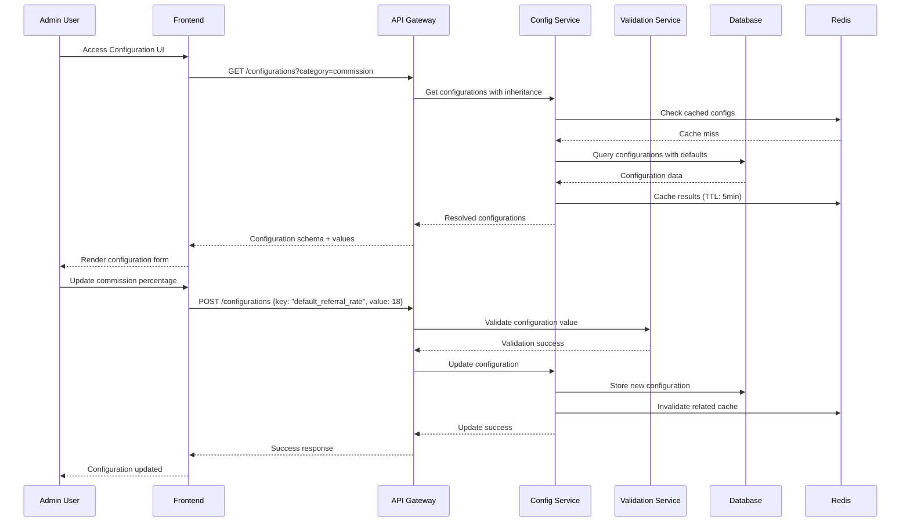
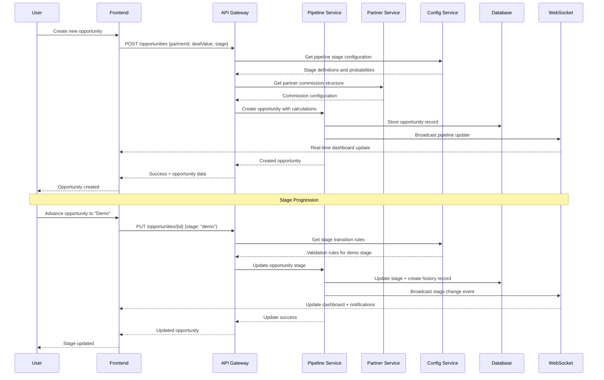

# Core Workflows

## Configuration Management Workflow

```mermaid
sequenceDiagram
    participant A as Admin User
    participant F as Frontend
    participant API as API Gateway
    participant C as Config Service
    participant V as Validation Service
    participant DB as Database
    participant Cache as Redis

    A->>F: Access Configuration UI
    F->>API: GET /configurations?category=commission
    API->>C: Get configurations with inheritance
    C->>Cache: Check cached configs
    Cache-->>C: Cache miss
    C->>DB: Query configurations with defaults
    DB-->>C: Configuration data
    C->>Cache: Cache results (TTL: 5min)
    C-->>API: Resolved configurations
    API-->>F: Configuration schema + values
    F-->>A: Render configuration form

    A->>F: Update commission percentage
    F->>API: POST /configurations {key: "default_referral_rate", value: 18}
    API->>V: Validate configuration value
    V-->>API: Validation success
    API->>C: Update configuration
    C->>DB: Store new configuration
    C->>Cache: Invalidate related cache
    C-->>API: Update success
    API-->>F: Success response
    F-->>A: Configuration updated
```

## Opportunity Management Workflow

```mermaid
sequenceDiagram
    participant U as User
    participant F as Frontend
    participant API as API Gateway
    participant P as Pipeline Service
    participant PS as Partner Service
    participant C as Config Service
    participant DB as Database
    participant WS as WebSocket

    U->>F: Create new opportunity
    F->>API: POST /opportunities {partnerId, dealValue, stage}
    API->>C: Get pipeline stage configuration
    C-->>API: Stage definitions and probabilities
    API->>PS: Get partner commission structure
    PS-->>API: Commission configuration
    API->>P: Create opportunity with calculations
    P->>DB: Store opportunity record
    P->>WS: Broadcast pipeline update
    WS-->>F: Real-time dashboard update
    P-->>API: Created opportunity
    API-->>F: Success + opportunity data
    F-->>U: Opportunity created

    Note over U,WS: Stage Progression
    U->>F: Advance opportunity to "Demo"
    F->>API: PUT /opportunities/{id} {stage: "demo"}
    API->>C: Get stage transition rules
    C-->>API: Validation rules for demo stage
    API->>P: Update opportunity stage
    P->>DB: Update stage + create history record
    P->>WS: Broadcast stage change event
    WS-->>F: Update dashboard + notifications
    P-->>API: Update success
    API-->>F: Updated opportunity
    F-->>U: Stage updated
```
