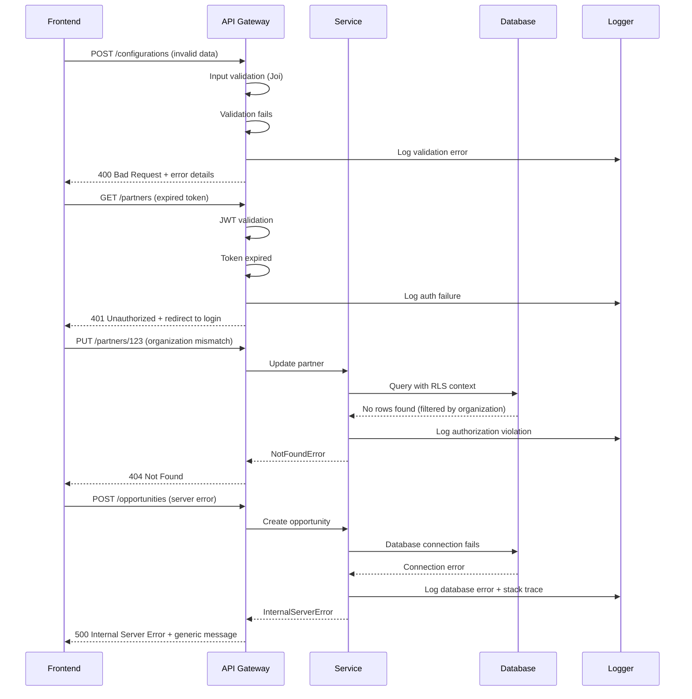

# Error Handling Strategy

## Error Flow



## Error Response Format

```typescript
interface ApiError {
  error: {
    code: string;           // Machine-readable error code
    message: string;        // Human-readable error message
    details?: {            // Additional error context
      field?: string;      // Field that caused validation error
      expected?: any;      // Expected value/format
      received?: any;      // Actual value received
      constraint?: string; // Database constraint violated
    };
    timestamp: string;     // ISO 8601 timestamp
    requestId: string;     // Unique request identifier for tracing
    organizationId?: string; // Organization context (for debugging)
  };
}

// Example error responses:
{
  "error": {
    "code": "VALIDATION_ERROR",
    "message": "Commission rate must be between 0 and 100",
    "details": {
      "field": "commissionRate",
      "expected": "number between 0 and 100",
      "received": 150
    },
    "timestamp": "2025-01-14T10:30:00.000Z",
    "requestId": "req_12345",
    "organizationId": "org_abc123"
  }
}

{
  "error": {
    "code": "CONFIGURATION_NOT_FOUND",
    "message": "Configuration key 'pipeline_stages' not found for organization",
    "details": {
      "category": "pipeline",
      "key": "pipeline_stages"
    },
    "timestamp": "2025-01-14T10:30:00.000Z",
    "requestId": "req_12346"
  }
}
```

## Frontend Error Handling

```typescript
// Global error boundary for React components
class GlobalErrorBoundary extends React.Component<
  { children: React.ReactNode },
  { hasError: boolean; error?: Error }
> {
  constructor(props: { children: React.ReactNode }) {
    super(props);
    this.state = { hasError: false };
  }

  static getDerivedStateFromError(error: Error) {
    return { hasError: true, error };
  }

  componentDidCatch(error: Error, errorInfo: React.ErrorInfo) {
    console.error('React Error Boundary caught an error:', error, errorInfo);

    // Report error to monitoring service
    reportError(error, {
      type: 'react_error',
      component: errorInfo.componentStack,
      user: getCurrentUser(),
      organization: getCurrentOrganization()
    });
  }

  render() {
    if (this.state.hasError) {
      return (
        <Box display="flex" flexDirection="column" alignItems="center" p={4}>
          <Typography variant="h5" color="error" gutterBottom>
            Something went wrong
          </Typography>
          <Typography variant="body1" color="textSecondary" gutterBottom>
            We've been notified and are working to fix this issue.
          </Typography>
          <Button
            variant="contained"
            onClick={() => window.location.reload()}
            sx={{ mt: 2 }}
          >
            Reload Page
          </Button>
        </Box>
      );
    }

    return this.props.children;
  }
}

// API error handling hook
export const useApiErrorHandler = () => {
  const navigate = useNavigate();
  const { logout } = useAuth();
  const [showError, setShowError] = useState<string | null>(null);

  const handleApiError = useCallback((error: any) => {
    if (error.response?.status === 401) {
      logout();
      navigate('/login', { state: { message: 'Session expired. Please log in again.' } });
      return;
    }

    if (error.response?.status === 403) {
      setShowError('You do not have permission to perform this action.');
      return;
    }

    if (error.response?.status >= 400 && error.response?.status < 500) {
      const errorMessage = error.response.data?.error?.message || 'Invalid request.';
      setShowError(errorMessage);
      return;
    }

    if (error.response?.status >= 500) {
      setShowError('Server error. Please try again or contact support.');
      reportError(error, { type: 'api_error' });
      return;
    }

    setShowError('Network error. Please check your connection and try again.');
  }, [logout, navigate]);

  return { handleApiError, showError, clearError: () => setShowError(null) };
};
```

## Backend Error Handling

```typescript
// Custom error classes
export class AppError extends Error {
  public readonly statusCode: number;
  public readonly code: string;
  public readonly isOperational: boolean;
  public readonly details?: any;

  constructor(
    message: string,
    statusCode: number = 500,
    code: string = 'INTERNAL_ERROR',
    isOperational: boolean = true,
    details?: any
  ) {
    super(message);
    this.statusCode = statusCode;
    this.code = code;
    this.isOperational = isOperational;
    this.details = details;

    Error.captureStackTrace(this, this.constructor);
  }
}

export class ValidationError extends AppError {
  constructor(message: string, field?: string, expected?: any, received?: any) {
    super(message, 400, 'VALIDATION_ERROR', true, { field, expected, received });
  }
}

export class NotFoundError extends AppError {
  constructor(resource: string, identifier?: string) {
    const message = identifier
      ? `${resource} with ID '${identifier}' not found`
      : `${resource} not found`;
    super(message, 404, 'RESOURCE_NOT_FOUND', true, { resource, identifier });
  }
}

export class ConfigurationError extends AppError {
  constructor(category: string, key: string) {
    super(
      `Configuration '${key}' not found in category '${category}'`,
      404,
      'CONFIGURATION_NOT_FOUND',
      true,
      { category, key }
    );
  }
}

// Global error handler middleware
export const errorHandler = (
  error: Error,
  req: Request,
  res: Response,
  next: NextFunction
) => {
  const requestId = req.headers['x-request-id'] as string || generateRequestId();
  const organizationId = (req as AuthenticatedRequest).user?.organizationId;

  // Log error with context
  logger.error('API Error', {
    error: {
      message: error.message,
      stack: error.stack,
      name: error.constructor.name
    },
    request: {
      id: requestId,
      method: req.method,
      url: req.originalUrl,
      userAgent: req.get('User-Agent'),
      ip: req.ip,
      organizationId
    },
    timestamp: new Date().toISOString()
  });

  // Handle operational errors
  if (error instanceof AppError && error.isOperational) {
    return res.status(error.statusCode).json({
      error: {
        code: error.code,
        message: error.message,
        details: error.details,
        timestamp: new Date().toISOString(),
        requestId,
        organizationId
      }
    });
  }

  // Handle validation errors
  if (error.name === 'ValidationError') {
    return res.status(400).json({
      error: {
        code: 'VALIDATION_ERROR',
        message: error.message,
        timestamp: new Date().toISOString(),
        requestId,
        organizationId
      }
    });
  }

  // Handle database errors
  if (error.name === 'QueryFailedError' || error.name === 'DatabaseError') {
    return res.status(500).json({
      error: {
        code: 'DATABASE_ERROR',
        message: 'Database operation failed',
        timestamp: new Date().toISOString(),
        requestId,
        organizationId
      }
    });
  }

  // Handle unexpected errors
  logger.error('Unexpected Error', { error, requestId });

  return res.status(500).json({
    error: {
      code: 'INTERNAL_ERROR',
      message: 'An unexpected error occurred',
      timestamp: new Date().toISOString(),
      requestId,
      organizationId
    }
  });
};

// Async error wrapper
export const asyncHandler = (fn: Function) => (req: Request, res: Response, next: NextFunction) => {
  Promise.resolve(fn(req, res, next)).catch(next);
};
```
