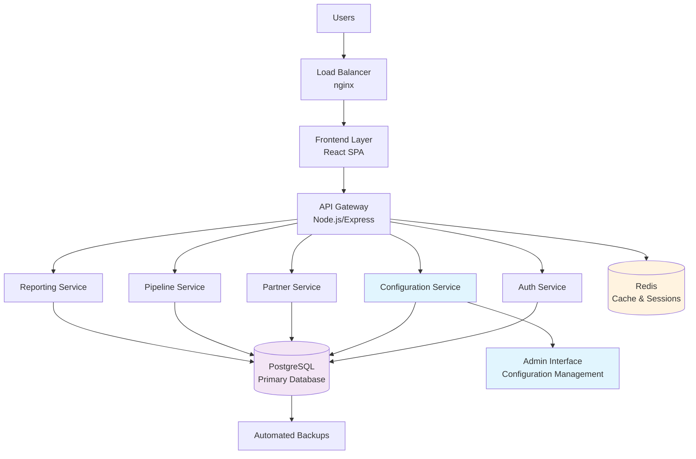

# High Level Architecture

## Technical Summary

The Partnership Management Platform follows a containerized three-tier architecture with configuration-first design, deployed via Docker containers for maximum flexibility. The React frontend communicates with a Node.js/Express backend through RESTful APIs, while PostgreSQL serves as the primary database with Redis for caching and real-time features. The architecture prioritizes multi-tenant configuration capabilities, allowing organizations to customize team sizes, revenue targets, commission structures, and partnership workflows. All components are designed for horizontal scaling with clear service boundaries, supporting both single-tenant local deployment and future multi-tenant cloud deployment.

## Platform and Infrastructure Choice

**Platform**: Docker-first with cloud-agnostic design
**Key Services**:
- Frontend: React SPA with Material-UI
- Backend: Node.js/Express REST API
- Database: PostgreSQL 15 with JSON support
- Cache/Sessions: Redis 7
- Reverse Proxy: nginx
- Container Orchestration: Docker Compose (local), Kubernetes-ready

**Deployment Host and Regions**: Initially local Docker deployment, architected for seamless migration to AWS/GCP/Azure with multi-region support

## Repository Structure

**Structure**: Monorepo with clear package boundaries
**Monorepo Tool**: npm workspaces (lightweight, built-in)
**Package Organization**: Frontend, backend, shared types, and configuration packages with clear dependency management

## High Level Architecture Diagram

## Architectural Patterns

- **Configuration-First Architecture**: All business logic driven by configurable settings stored in database - _Rationale:_ Enables multi-tenant deployment and customization without code changes
- **Domain-Driven Design**: Clear service boundaries around business domains (Partners, Pipeline, Configuration) - _Rationale:_ Maintains scalability and allows independent service evolution
- **Repository Pattern**: Abstract data access layer with configuration-aware queries - _Rationale:_ Enables testing and supports multi-tenant data isolation
- **API Gateway Pattern**: Single entry point with tenant-aware routing and authentication - _Rationale:_ Centralizes cross-cutting concerns and simplifies client integration
- **Event-Driven Updates**: Real-time dashboard updates via WebSocket events - _Rationale:_ Provides immediate visibility for executive-level decision making
- **Configuration Inheritance**: Tenant → Organization → Global configuration hierarchy - _Rationale:_ Balances customization with sensible defaults
