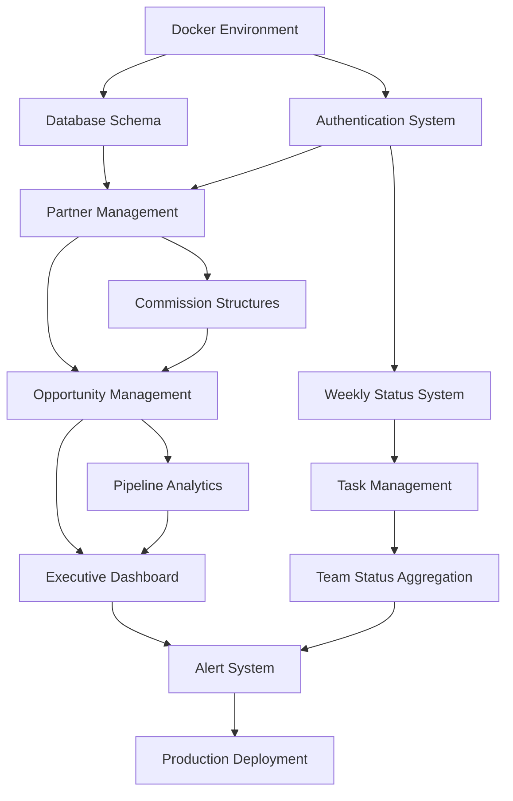

# ISV Pipeline Tracker MVP - Development Planning Document

## Executive Summary

This development planning document provides comprehensive sprint planning for the ISV Pipeline Tracker MVP based on project requirements from the technical architecture, PRD, and project brief. The plan structures 6 weeks of development across 3 two-week sprints, optimized for a single full-stack developer with VP Strategic Partnerships feedback loops.

**Key Objectives:**
- Deliver functional MVP in 6 weeks supporting $250K quarterly revenue tracking
- Enable VP oversight of 5-person team across 20+ ISV partners
- Transform weekly meetings from status collection to strategic planning
- Establish Docker-based platform foundation for future scaling

---

## 1. Sprint Breakdown Overview (6 Weeks, 3 Sprints)

### Sprint 1: Foundation & Core Infrastructure (Weeks 1-2)
**Theme:** "Build the Foundation"
**Goal:** Establish development environment, core architecture, and basic authentication
**Key Deliverables:** Docker environment, database schema, authentication system, basic UI framework

### Sprint 2: Core Business Logic (Weeks 3-4)
**Theme:** "Enable Core Workflows"
**Goal:** Implement partner management, opportunity pipeline, and commission calculation
**Key Deliverables:** Partner CRUD, opportunity tracking, commission engine, executive dashboard

### Sprint 3: User Experience & Integration (Weeks 5-6)
**Theme:** "Polish and Integrate"
**Goal:** Complete user workflows, status management, alerts, and production readiness
**Key Deliverables:** Weekly status system, task management, alert system, production deployment

---

## 2. Detailed Sprint Planning

# Sprint 1: Foundation & Core Infrastructure (Weeks 1-2)

## Sprint 1 Goals
- **Primary:** Establish robust development foundation with Docker environment
- **Secondary:** Implement authentication and basic data models
- **Success Criteria:** Development environment launches with `docker-compose up`, authentication works end-to-end

## User Stories Prioritized for Sprint 1

### Epic 1: Development Environment Setup
**Priority: P0 (Blocker)**

#### User Story 1.1.1: Docker Development Environment
**As a** Developer
**I want** a complete Docker-based development environment
**So that** I can develop consistently and deploy reliably

**Acceptance Criteria:**
- [ ] Docker Compose configuration with all services (frontend, backend, postgres, redis, nginx)
- [ ] Development environment with hot reloading
- [ ] Database migrations and seed data
- [ ] Health checks for all services
- [ ] Environment variable management
- [ ] Development workflow documentation

**Tasks:**
- Set up Docker Compose configuration files
- Configure PostgreSQL with initial schema
- Set up Redis for session/cache storage
- Configure nginx reverse proxy
- Implement health check endpoints
- Create database migration scripts
- Write development setup documentation

**Estimate:** 3 days
**Dependencies:** None

### Epic 2: Authentication Foundation
**Priority: P0 (Blocker)**

#### User Story 1.2.1: User Authentication System
**As a** Team Member
**I want** secure login with role-based access
**So that** I can access appropriate system functions based on my role

**Acceptance Criteria:**
- [ ] JWT-based authentication with refresh tokens
- [ ] Role-based access control (VP, Sales Manager, Partnership Manager)
- [ ] Secure password hashing with bcrypt
- [ ] Login/logout functionality
- [ ] Session management with Redis
- [ ] Password reset capability (basic)
- [ ] User profile management

**Tasks:**
- Implement JWT authentication middleware
- Create user model and database schema
- Build login/logout API endpoints
- Implement role-based authorization
- Create user management interfaces
- Set up session storage with Redis
- Build basic user profile pages

**Estimate:** 4 days
**Dependencies:** Docker environment

### Epic 3: Core Data Models
**Priority: P1 (High)**

#### User Story 1.3.1: Database Schema Implementation
**As a** Developer
**I want** complete database schema with relationships
**So that** all business entities are properly modeled and connected

**Acceptance Criteria:**
- [ ] Users table with role management
- [ ] ISV Partners table with relationship health
- [ ] Commission Structures with flexible rules
- [ ] Opportunities table with stage tracking
- [ ] Opportunity stage history for audit trail
- [ ] Weekly status and tasks tables
- [ ] Quarterly goals and alerts tables
- [ ] Proper foreign key relationships and indexes
- [ ] Database migration scripts

**Tasks:**
- Design and implement complete database schema
- Create migration scripts for all tables
- Set up proper indexes for performance
- Implement referential integrity constraints
- Create seed data for development
- Set up backup and restore procedures
- Document data model relationships

**Estimate:** 2 days
**Dependencies:** Docker environment

### Epic 4: Basic UI Framework
**Priority: P1 (High)**

#### User Story 1.4.1: React Application Foundation
**As a** Developer
**I want** React application structure with routing and theming
**So that** I can build consistent user interfaces efficiently

**Acceptance Criteria:**
- [ ] React 18 application with TypeScript
- [ ] Material-UI theming and component library
- [ ] React Router for navigation
- [ ] Authentication-protected routes
- [ ] Basic layout with header and sidebar
- [ ] Responsive design foundation
- [ ] Error boundary implementation
- [ ] Loading states and error handling

**Tasks:**
- Set up React application with TypeScript
- Configure Material-UI theme and components
- Implement React Router with protected routes
- Create layout components (Header, Sidebar, Layout)
- Set up authentication context and hooks
- Implement error boundaries and loading states
- Configure responsive breakpoints
- Set up form validation with React Hook Form

**Estimate:** 2 days
**Dependencies:** None (can develop in parallel)

## Sprint 1 Daily Breakdown

### Week 1
**Day 1-2 (Mon-Tue): Environment Foundation**
- Docker Compose setup and configuration
- PostgreSQL and Redis service configuration
- nginx reverse proxy setup
- Basic health checks implementation
- Initial documentation

**Day 3 (Wed): Database Design & Migration**
- Complete database schema implementation
- Migration scripts creation
- Seed data development
- Index optimization

**Day 4-5 (Thu-Fri): Authentication Backend**
- JWT authentication middleware
- User model and endpoints
- Role-based authorization
- Password hashing and security

### Week 2
**Day 6-7 (Mon-Tue): Authentication Frontend**
- React authentication context
- Login/logout components
- Protected route implementation
- User profile interfaces

**Day 8-9 (Wed-Thu): React Foundation**
- React app structure and routing
- Material-UI theme setup
- Layout components
- Navigation framework

**Day 10 (Fri): Integration & Testing**
- End-to-end authentication testing
- Docker environment validation
- Sprint review preparation
- Bug fixes and polish

## Sprint 1 Definition of Done

### Technical Requirements
- [ ] Docker Compose launches all services successfully
- [ ] Authentication flow works end-to-end
- [ ] Database migrations run without errors
- [ ] All services pass health checks
- [ ] Code coverage >80% on implemented features
- [ ] No security vulnerabilities in authentication

### Functional Requirements
- [ ] Users can login with valid credentials
- [ ] Role-based access properly enforced
- [ ] Basic navigation works across the application
- [ ] Database contains proper seed data
- [ ] Error handling works for invalid login attempts
- [ ] Performance: Login completes in <2 seconds

### Documentation
- [ ] Development environment setup guide
- [ ] Database schema documentation
- [ ] API authentication documentation
- [ ] Code comments for complex logic
- [ ] Sprint review documentation

---

# Sprint 2: Core Business Logic (Weeks 3-4)

## Sprint 2 Goals
- **Primary:** Implement core business entities (Partners, Opportunities, Commissions)
- **Secondary:** Build executive dashboard with real-time KPIs
- **Success Criteria:** VP can manage partners, track opportunities through pipeline, and view dashboard metrics

## User Stories Prioritized for Sprint 2

### Epic 1: Partner Management System
**Priority: P0 (Blocker)**

#### User Story 2.1.1: ISV Partner CRUD Operations
**As a** VP Strategic Partnerships
**I want** comprehensive partner management with performance tracking
**So that** I can maintain strategic relationships and monitor partner effectiveness

**Acceptance Criteria:**
- [ ] Create, read, update, delete partner records
- [ ] Partner categorization by domain (FinOps, Security, Observability, DevOps, Data)
- [ ] Relationship health scoring with visual indicators
- [ ] Contact information management
- [ ] Partner performance metrics display
- [ ] Search and filtering capabilities
- [ ] Partner history and interaction tracking
- [ ] Bulk operations for efficiency

**Tasks:**
- Implement partner CRUD API endpoints
- Build partner management UI components
- Create partner detail pages
- Implement search and filtering
- Add relationship health indicators
- Build partner performance analytics
- Create partner interaction history

**Estimate:** 3 days
**Dependencies:** Authentication system, database schema

#### User Story 2.1.2: Commission Structure Management
**As a** VP Strategic Partnerships
**I want** flexible commission structure configuration per partner
**So that** I can accurately track and calculate commission payments

**Acceptance Criteria:**
- [ ] Support 10-40% commission ranges
- [ ] Handle lifetime vs one-time commission models
- [ ] Manage referral, MSP, and reseller structures
- [ ] Set minimum and maximum deal size thresholds
- [ ] Track effective date ranges for commission changes
- [ ] Commission structure versioning
- [ ] Integration with opportunity management
- [ ] Validation of commission rules

**Tasks:**
- Design commission structure data model
- Implement commission CRUD operations
- Build commission configuration UI
- Create commission calculation engine
- Implement validation rules
- Add commission structure versioning
- Build commission preview/testing tools

**Estimate:** 3 days
**Dependencies:** Partner management

### Epic 2: Opportunity Pipeline Management
**Priority: P0 (Blocker)**

#### User Story 2.2.1: Opportunity Lifecycle Tracking
**As a** Sales Manager
**I want** complete opportunity management through sales cycle
**So that** I can systematically track progress and prevent lost opportunities

**Acceptance Criteria:**
- [ ] Create opportunities with customer and deal details
- [ ] Stage progression (Lead → Demo → POC → Proposal → Closed Won/Lost)
- [ ] Automated stage history logging
- [ ] Probability adjustment by stage
- [ ] Due date management with alerts
- [ ] Opportunity value forecasting
- [ ] Assignment to team members
- [ ] Notes and activity tracking

**Tasks:**
- Implement opportunity CRUD API
- Build opportunity creation/editing forms
- Create pipeline stage progression logic
- Implement stage history tracking
- Build opportunity detail pages
- Add probability and forecasting
- Create opportunity assignment features

**Estimate:** 4 days
**Dependencies:** Partner management, authentication

#### User Story 2.2.2: Pipeline Visualization and Analytics
**As a** VP Strategic Partnerships
**I want** visual pipeline representation with analytics
**So that** I can identify bottlenecks and forecast revenue accurately

**Acceptance Criteria:**
- [ ] Interactive funnel chart by pipeline stage
- [ ] Opportunity lists with stage-based filtering
- [ ] Conversion rate calculations between stages
- [ ] Weighted pipeline value calculations
- [ ] Historical trend analysis
- [ ] Team member pipeline comparison
- [ ] Export capabilities for external analysis
- [ ] Real-time updates via WebSocket

**Tasks:**
- Build pipeline funnel visualization
- Create opportunity list views with filtering
- Implement conversion rate calculations
- Add weighted pipeline calculations
- Build trend analysis components
- Create export functionality
- Set up WebSocket for real-time updates

**Estimate:** 3 days
**Dependencies:** Opportunity management

### Epic 3: Executive Dashboard
**Priority: P1 (High)**

#### User Story 2.3.1: Real-time KPI Dashboard
**As a** VP Strategic Partnerships
**I want** executive dashboard with key performance indicators
**So that** I can make informed decisions and track quarterly progress

**Acceptance Criteria:**
- [ ] Quarterly revenue progress indicator ($XXX of $250K target)
- [ ] Pipeline value by stage with conversion rates
- [ ] Team member performance summary
- [ ] Partner relationship health matrix
- [ ] Real-time updates without page refresh
- [ ] Responsive design for desktop and tablet
- [ ] Loading states and error handling
- [ ] Configurable refresh intervals

**Tasks:**
- Design dashboard layout and components
- Implement KPI calculation APIs
- Build revenue progress indicators
- Create pipeline summary widgets
- Add team performance cards
- Implement real-time WebSocket updates
- Add responsive design
- Build dashboard configuration options

**Estimate:** 3 days
**Dependencies:** Opportunity pipeline, partner management

## Sprint 2 Daily Breakdown

### Week 3
**Day 11-12 (Mon-Tue): Partner Management Backend**
- Partner CRUD API implementation
- Relationship health scoring logic
- Partner performance calculations
- Search and filtering APIs

**Day 13 (Wed): Partner Management Frontend**
- Partner list and detail views
- Partner creation/editing forms
- Relationship health indicators
- Partner performance displays

**Day 14-15 (Thu-Fri): Commission Structure System**
- Commission calculation engine
- Commission structure management
- Validation rules implementation
- Commission preview tools

### Week 4
**Day 16-17 (Mon-Tue): Opportunity Management Backend**
- Opportunity CRUD operations
- Stage progression logic
- Opportunity history tracking
- Assignment and notification logic

**Day 18 (Wed): Opportunity Management Frontend**
- Opportunity creation/editing forms
- Opportunity detail pages
- Stage progression interface
- Assignment management

**Day 19-20 (Thu-Fri): Pipeline Analytics & Dashboard**
- Pipeline visualization components
- KPI calculation implementation
- Executive dashboard assembly
- Real-time updates via WebSocket

## Sprint 2 Definition of Done

### Technical Requirements
- [ ] All CRUD operations work for partners and opportunities
- [ ] Commission calculations are accurate for all models
- [ ] Real-time updates work via WebSocket
- [ ] API response times <500ms average
- [ ] Database queries optimized with proper indexes
- [ ] Code coverage >85% on business logic

### Functional Requirements
- [ ] VP can manage all partner relationships effectively
- [ ] Sales team can create and progress opportunities through pipeline
- [ ] Commission calculations match manual verification
- [ ] Dashboard displays accurate real-time KPIs
- [ ] Pipeline visualization shows current state accurately
- [ ] All user roles have appropriate access controls

### User Acceptance Testing
- [ ] VP can complete full partner management workflow
- [ ] Sales Manager can manage opportunity lifecycle
- [ ] Commission calculations are verified by finance team
- [ ] Dashboard meets VP's daily oversight needs
- [ ] Performance meets <2 second load time requirement

---

# Sprint 3: User Experience & Integration (Weeks 5-6)

## Sprint 3 Goals
- **Primary:** Complete weekly status workflow and task management
- **Secondary:** Implement alert system and production deployment
- **Success Criteria:** Team can complete weekly updates in <15 minutes, system is production-ready

## User Stories Prioritized for Sprint 3

### Epic 1: Weekly Status and Task Management
**Priority: P0 (Blocker)**

#### User Story 3.1.1: Weekly Status Submission
**As a** Team Member
**I want** streamlined weekly status update interface
**So that** I can efficiently report progress with minimal administrative overhead

**Acceptance Criteria:**
- [ ] Simple form with accomplishments, tasks, and blockers sections
- [ ] Auto-save functionality every 30 seconds
- [ ] Rich text editor for detailed descriptions
- [ ] Integration with opportunity and task activities
- [ ] Historical status view for reference
- [ ] Submission deadline tracking
- [ ] Mobile-responsive interface
- [ ] Offline capability for status updates

**Tasks:**
- Design weekly status form interface
- Implement auto-save functionality
- Add rich text editing capability
- Build status history views
- Create mobile-responsive design
- Add offline storage capability
- Implement submission tracking

**Estimate:** 2 days
**Dependencies:** Authentication, basic UI framework

#### User Story 3.1.2: Task Management and Rollover
**As a** Team Member
**I want** intelligent task management with automatic rollover
**So that** I can maintain productivity without losing incomplete work

**Acceptance Criteria:**
- [ ] Task creation with priority levels and due dates
- [ ] Task completion tracking with timestamps
- [ ] Automatic rollover of incomplete tasks to next week
- [ ] Task categorization by opportunity/partner/administrative
- [ ] Bulk task operations (completion, rescheduling, deletion)
- [ ] Task assignment and delegation between team members
- [ ] Integration with weekly status reporting
- [ ] Task analytics and productivity tracking

**Tasks:**
- Implement task CRUD operations
- Build task rollover automation logic
- Create task management UI components
- Add bulk operations capability
- Implement task assignment features
- Build task analytics dashboard
- Create task integration with status updates

**Estimate:** 2 days
**Dependencies:** Weekly status system

#### User Story 3.1.3: Team Status Aggregation
**As a** VP Strategic Partnerships
**I want** consolidated team status view with analytics
**So that** I can understand team activities and provide targeted support

**Acceptance Criteria:**
- [ ] Week-by-week team status aggregation
- [ ] Activity analysis with completion rates
- [ ] Blocker escalation and resolution tracking
- [ ] Team productivity metrics and trends
- [ ] Status submission compliance monitoring
- [ ] Individual and team accomplishment highlighting
- [ ] Export capabilities for performance reviews
- [ ] Filter and search across team status history

**Tasks:**
- Build team status aggregation APIs
- Create team status dashboard views
- Implement productivity analytics
- Add blocker tracking and escalation
- Build compliance monitoring
- Create export functionality
- Add filtering and search capabilities

**Estimate:** 2 days
**Dependencies:** Individual status submission

### Epic 2: Alert and Notification System
**Priority: P1 (High)**

#### User Story 3.2.1: Proactive Alert Management
**As a** VP Strategic Partnerships
**I want** comprehensive alert system for critical business events
**So that** I can take proactive action on opportunities and relationships

**Acceptance Criteria:**
- [ ] Opportunity alerts (stage stagnation, close date approaching, high-value changes)
- [ ] Relationship maintenance alerts based on interaction timing
- [ ] Goal milestone alerts (progress, behind schedule, achievement)
- [ ] Task overdue alerts with manager escalation
- [ ] Commission calculation alerts for review
- [ ] Configurable alert thresholds and preferences
- [ ] In-app notification center
- [ ] Email notifications for critical alerts

**Tasks:**
- Design alert engine architecture
- Implement alert generation logic
- Build notification center UI
- Create alert configuration interface
- Add email notification capability
- Implement alert prioritization
- Build alert history and tracking

**Estimate:** 3 days
**Dependencies:** All business entities

#### User Story 3.2.2: Alert Management Interface
**As a** Team Member
**I want** prioritized alert system with clear actions
**So that** I can focus on highest-impact activities efficiently

**Acceptance Criteria:**
- [ ] Priority-based alert sorting and display
- [ ] Alert categorization by type and urgency
- [ ] Bulk alert management (read, dismiss, archive)
- [ ] Direct navigation to related entities
- [ ] Alert frequency controls to prevent overload
- [ ] Historical alert analysis for patterns
- [ ] Custom alert rules based on role
- [ ] Mobile-optimized alert interface

**Tasks:**
- Build alert management UI components
- Implement alert sorting and filtering
- Add bulk operations capability
- Create alert action buttons
- Build historical alert views
- Add mobile-optimized interface
- Implement custom alert rules

**Estimate:** 2 days
**Dependencies:** Alert engine

### Epic 3: Production Readiness
**Priority: P0 (Blocker)**

#### User Story 3.3.1: Production Deployment
**As a** VP Strategic Partnerships
**I want** reliable production deployment with monitoring
**So that** the system is available and performs well for daily operations

**Acceptance Criteria:**
- [ ] Production Docker Compose configuration
- [ ] SSL/TLS security with proper certificates
- [ ] Automated backup and recovery procedures
- [ ] Performance monitoring and alerting
- [ ] Health checks and uptime monitoring
- [ ] Log aggregation and analysis
- [ ] Security hardening and audit logging
- [ ] Deployment automation and rollback capability

**Tasks:**
- Create production Docker configuration
- Set up SSL certificates and security
- Implement backup and recovery procedures
- Configure monitoring stack (Prometheus/Grafana)
- Set up log aggregation
- Implement security hardening
- Create deployment automation scripts
- Build health monitoring dashboard

**Estimate:** 2 days
**Dependencies:** All application features

## Sprint 3 Daily Breakdown

### Week 5
**Day 21-22 (Mon-Tue): Weekly Status System**
- Status submission form implementation
- Auto-save and offline capability
- Rich text editing integration
- Status history views

**Day 23-24 (Wed-Thu): Task Management**
- Task CRUD operations and UI
- Rollover automation logic
- Task assignment and delegation
- Task analytics implementation

**Day 25 (Fri): Team Status Aggregation**
- Team status dashboard
- Productivity analytics
- Blocker tracking
- Status compliance monitoring

### Week 6
**Day 26-27 (Mon-Tue): Alert System**
- Alert engine implementation
- Notification center UI
- Alert configuration interface
- Email notification setup

**Day 28 (Wed): Alert Management**
- Alert management interface
- Prioritization and filtering
- Bulk operations
- Mobile optimization

**Day 29-30 (Thu-Fri): Production Deployment**
- Production environment setup
- Monitoring and security
- Backup procedures
- Final testing and launch

## Sprint 3 Definition of Done

### Technical Requirements
- [ ] All user workflows complete end-to-end
- [ ] Alert system generates and delivers notifications properly
- [ ] Production environment configured and secured
- [ ] Monitoring stack operational with dashboards
- [ ] Backup and recovery procedures tested
- [ ] Security audit passed (basic level)

### Functional Requirements
- [ ] Team members can submit weekly status in <15 minutes
- [ ] Task rollover works automatically each week
- [ ] VP receives appropriate alerts for all critical events
- [ ] Production system meets performance requirements
- [ ] All user acceptance testing completed successfully
- [ ] System handles 5-10 concurrent users without degradation

### Production Readiness
- [ ] SSL certificates installed and working
- [ ] Automated backups running daily
- [ ] Monitoring alerts configured for system health
- [ ] Production deployment documentation complete
- [ ] User training materials prepared
- [ ] Support and maintenance procedures documented

---

## 3. Technical Task Dependencies Map

### Critical Path Dependencies



### Parallel Development Opportunities

**Can be developed simultaneously:**
- Frontend React framework (while backend APIs are being built)
- Database schema design (while Docker environment is being configured)
- UI components (while business logic is being implemented)
- Monitoring setup (while core features are being built)

**Must be sequential:**
- Authentication before any business features
- Partner management before opportunity management
- Core entities before dashboard analytics
- All features before production deployment

---

## 4. Risk Mitigation and Contingency Planning

### High-Priority Risks

#### Risk 1: Commission Calculation Complexity
**Probability:** High (70%)
**Impact:** High
**Days at Risk:** Days 14-15, 19-20

**Mitigation Strategy:**
- **Pre-Sprint:** Detailed audit of all partner agreements (2 days before Sprint 2)
- **During Development:** Create test scenarios for all commission models
- **Contingency:** Manual override system for complex cases
- **Buffer Time:** Add 1 day buffer for commission engine in Sprint 2

**Early Warning Signs:**
- More than 3 different commission models discovered
- Edge cases not covered by initial design
- Finance team identifies calculation errors

#### Risk 2: Performance Issues with Dashboard
**Probability:** Medium (40%)
**Impact:** Medium
**Days at Risk:** Days 19-20, 26-27

**Mitigation Strategy:**
- **Pre-Sprint:** Load testing plan preparation
- **During Development:** Performance monitoring from day 1
- **Contingency:** Redis caching implementation for slow queries
- **Buffer Time:** 1 day allocated for performance optimization

**Early Warning Signs:**
- Dashboard load times >3 seconds
- Database queries >200ms average
- Real-time updates causing lag

#### Risk 3: Team Adoption Resistance
**Probability:** Medium (50%)
**Impact:** High
**Days at Risk:** Throughout development, critical at launch

**Mitigation Strategy:**
- **Weekly:** VP feedback sessions every Friday
- **User Testing:** Demo sessions at end of each sprint
- **Change Management:** Involve team in UI design decisions
- **Training Plan:** Hands-on training sessions planned for week 6

**Early Warning Signs:**
- Negative feedback from demo sessions
- UI complexity complaints
- Long status update times in testing

### Contingency Plans

#### If Development Falls Behind Schedule

**Week 1-2 Behind:**
- Move alert system to post-MVP
- Simplify executive dashboard to basic KPIs only
- Use basic HTML forms instead of rich UI components

**Week 3-4 Behind:**
- Reduce commission structure complexity
- Simplify pipeline analytics to basic lists
- Defer real-time updates to post-MVP

**Week 5-6 Behind:**
- Launch with manual task management
- Simplify production deployment
- Plan post-launch feature additions

#### If Technical Blockers Occur

**Database Performance Issues:**
- Implement aggressive caching with Redis
- Optimize queries with database consultant
- Consider read-replica for reporting queries

**Frontend Performance Issues:**
- Implement lazy loading for all components
- Reduce dashboard complexity
- Add pagination to all lists

**Integration Complexity:**
- Build simpler REST interfaces
- Reduce real-time features
- Focus on core CRUD operations

---

## 5. Daily/Weekly Development Workflow

### Daily Development Routine

#### Morning Routine (9:00-9:30 AM)
1. **Environment Health Check** (5 minutes)
   - Verify Docker containers running
   - Check database connectivity
   - Review overnight logs

2. **Daily Planning** (15 minutes)
   - Review current sprint tasks
   - Identify blockers or dependencies
   - Plan task prioritization for day

3. **Code Review** (10 minutes)
   - Review previous day's code
   - Check for any merge conflicts
   - Validate test coverage

#### Development Sessions

**Session 1: 9:30 AM - 12:00 PM (2.5 hours)**
- Focus on primary feature development
- No interruptions or context switching
- Commit progress hourly

**Session 2: 1:00 PM - 4:00 PM (3 hours)**
- Continue feature development
- Write tests for completed features
- Update documentation

**Session 3: 4:00 PM - 5:00 PM (1 hour)**
- Code review and refactoring
- Bug fixes and polish
- Prepare for next day

#### End of Day Routine (5:00-5:30 PM)
1. **Code Commit and Push** (10 minutes)
   - Commit all work with descriptive messages
   - Push to remote repository
   - Update sprint board status

2. **Daily Log Update** (10 minutes)
   - Document progress and blockers
   - Update time estimates for remaining tasks
   - Note any technical decisions made

3. **Next Day Preparation** (10 minutes)
   - Review tomorrow's planned tasks
   - Set up any needed resources
   - Note any dependencies to address

### Weekly Development Cycle

#### Monday: Sprint Planning and Setup
- **Morning:** Sprint goal review and task prioritization
- **Midday:** Environment setup and dependency resolution
- **Evening:** First feature implementation begins

#### Tuesday-Thursday: Core Development
- **Focus:** Primary feature development
- **Testing:** Unit tests for completed features
- **Documentation:** Code comments and API documentation

#### Friday: Integration and Review
- **Morning:** Feature integration and testing
- **Afternoon:** VP demo and feedback session
- **Evening:** Sprint retrospective and next week planning

### VP Feedback Integration

#### Weekly Demo Sessions (Fridays 4:00-5:00 PM)
**Agenda:**
- Demo completed features (15 minutes)
- Gather feedback and requirements clarification (15 minutes)
- Review upcoming week priorities (15 minutes)
- Address any concerns or blockers (15 minutes)

**Deliverables:**
- Working demo in development environment
- Feedback documentation
- Updated requirements or priority changes
- Risk assessment updates

#### Mid-Sprint Check-ins (Wednesdays 3:00-3:30 PM)
**Purpose:** Course correction and blocker resolution
- Progress update against sprint goals
- Technical decision validation
- Resource or priority adjustments
- Early feedback on UI/UX direction

---

## 6. Testing and QA Integration

### Testing Strategy by Sprint

#### Sprint 1: Foundation Testing
**Unit Tests:**
- Authentication middleware (>95% coverage)
- Database models and relationships
- API endpoint functionality
- User role validation

**Integration Tests:**
- Docker container health checks
- Database migration validation
- Authentication flow end-to-end
- API security testing

**Acceptance Tests:**
- Login/logout user workflow
- Role-based access validation
- Basic navigation functionality
- Environment setup verification

#### Sprint 2: Business Logic Testing
**Unit Tests:**
- Commission calculation engine (100% coverage)
- Opportunity pipeline logic
- Partner management operations
- Dashboard KPI calculations

**Integration Tests:**
- Partner-opportunity relationships
- Commission-opportunity integration
- Dashboard real-time updates
- API performance under load

**Acceptance Tests:**
- Complete partner management workflow
- Opportunity creation through closure
- Commission calculation accuracy
- Executive dashboard functionality

#### Sprint 3: End-to-End Testing
**Unit Tests:**
- Weekly status submission logic
- Task rollover automation
- Alert generation rules
- Notification delivery system

**Integration Tests:**
- Status-task integration
- Alert-entity relationships
- Production environment validation
- Performance under concurrent users

**Acceptance Tests:**
- Complete weekly status workflow (<15 minutes)
- Task management lifecycle
- Alert system responsiveness
- Production deployment verification

### Quality Assurance Process

#### Development Phase QA (Ongoing)
**Daily Activities:**
- Automated test execution with each commit
- Code quality checks with ESLint/Prettier
- Security scan with npm audit
- Performance monitoring with Chrome DevTools

**Weekly Activities:**
- Comprehensive test suite execution
- Code coverage analysis (>90% target)
- Performance benchmark validation
- Security vulnerability assessment

#### User Acceptance Testing (Weekly)
**VP Testing Sessions:**
- Friday demo sessions with real workflow testing
- Usability feedback collection
- Performance perception validation
- Business requirement verification

**Team Member Testing:**
- Mid-sprint feedback on interfaces
- Workflow efficiency validation
- Mobile/tablet testing
- Accessibility testing

### Automated Testing Pipeline

#### Continuous Integration (GitHub Actions)
```yaml
# .github/workflows/ci.yml
name: CI Pipeline
on: [push, pull_request]
jobs:
  test:
    runs-on: ubuntu-latest
    steps:
      - name: Checkout code
      - name: Setup Node.js
      - name: Install dependencies
      - name: Run backend tests
      - name: Run frontend tests
      - name: Run integration tests
      - name: Security audit
      - name: Performance benchmarks
```

#### Quality Gates
- **Commit:** All unit tests pass, no linting errors
- **Daily:** Integration tests pass, performance meets targets
- **Weekly:** Full test suite passes, security scan clear
- **Sprint End:** User acceptance tests pass, production ready

---

## 7. Deployment and Go-Live Strategy

### Production Environment Setup

#### Infrastructure Requirements
**Hardware Specifications:**
- **Minimum:** 4 CPU cores, 8GB RAM, 100GB SSD
- **Recommended:** 8 CPU cores, 16GB RAM, 200GB SSD
- **Network:** Reliable internet connection, static IP
- **Operating System:** Ubuntu 22.04 LTS or CentOS 8

**Docker Production Configuration:**
```yaml
# docker-compose.prod.yml key requirements
- PostgreSQL with persistent volumes and automated backups
- Redis with data persistence and memory optimization
- nginx with SSL termination and security headers
- Application containers with resource limits
- Monitoring stack with Prometheus/Grafana
```

#### Security Hardening
**Pre-Deployment Security Checklist:**
- [ ] SSL certificates installed and configured
- [ ] Database access limited to application only
- [ ] Environment variables secured and encrypted
- [ ] Security headers configured in nginx
- [ ] User access controls properly configured
- [ ] Audit logging enabled for all critical operations
- [ ] Regular security updates scheduled
- [ ] Backup encryption enabled

### Deployment Process

#### Week 5: Staging Environment Setup
**Day 26-27:**
- Create production-identical staging environment
- Deploy current development version to staging
- Conduct performance testing under load
- Validate backup and recovery procedures

**Day 28:**
- Security audit and penetration testing
- SSL certificate installation and testing
- Domain name configuration and DNS setup
- Monitoring stack deployment and configuration

#### Week 6: Production Deployment
**Day 29: Pre-Deployment**
- Final staging environment validation
- Production data migration preparation
- Deployment runbook review and rehearsal
- Rollback procedures validation

**Day 30: Go-Live**
- **9:00 AM:** Production environment deployment
- **10:00 AM:** Smoke testing and health checks
- **11:00 AM:** User acceptance testing in production
- **12:00 PM:** Team training and system walkthrough
- **2:00 PM:** Go-live announcement and first production use
- **4:00 PM:** First production weekly status submission test
- **5:00 PM:** Go-live retrospective and issue logging

### Go-Live Support Plan

#### Week 6: Launch Week Support
**Daily Support Schedule:**
- **8:00-9:00 AM:** System health monitoring and issue review
- **9:00-10:00 AM:** Available for urgent issue resolution
- **12:00-1:00 PM:** Midday system check and user feedback collection
- **4:00-5:00 PM:** End-of-day wrap-up and issue documentation

#### Week 7-8: Stabilization Period
**Support Approach:**
- Daily system monitoring with weekly issue review
- Scheduled fix releases for non-critical issues
- User feedback collection and prioritization
- Performance optimization based on real usage

#### Post-Launch Monitoring
**Key Metrics to Track:**
- System uptime and availability (target: 99.9%)
- Response time performance (target: <2 seconds)
- User adoption rates (target: 100% team participation)
- Error rates and issue frequency
- User satisfaction scores

### Data Migration Strategy

#### Historical Data Import
**Pre-Launch Data Preparation:**
- Partner information from existing spreadsheets
- Historical opportunity data (last 6 months)
- Commission structure documentation
- Team member information and role assignments

**Migration Process:**
1. **Data Audit and Cleaning** (Week 5)
   - Validate data completeness and accuracy
   - Standardize partner and customer names
   - Verify commission structure details
   - Clean and normalize historical data

2. **Staged Import** (Week 6, Day 29)
   - Import partner information first
   - Import commission structures
   - Import historical opportunities
   - Import team member assignments

3. **Validation** (Week 6, Day 30)
   - Verify all data imported correctly
   - Run test calculations on historical data
   - Validate relationships and dependencies
   - Confirm user can access appropriate data

### Training and Change Management

#### User Training Plan
**Week 6 Training Schedule:**

**Monday (Day 26): VP Training Session**
- **Duration:** 2 hours
- **Focus:** Executive dashboard, partner management, team oversight
- **Format:** One-on-one hands-on training
- **Outcome:** VP comfortable with daily dashboard use

**Tuesday (Day 27): Sales Manager Training**
- **Duration:** 1.5 hours
- **Focus:** Opportunity management, pipeline tracking, status updates
- **Format:** Small group training (3 sales managers)
- **Outcome:** Managers can create and progress opportunities

**Wednesday (Day 28): Partnership Manager Training**
- **Duration:** 1 hour
- **Focus:** Partner management, relationship tracking, status updates
- **Format:** One-on-one training (2 partnership managers)
- **Outcome:** Managers comfortable with partner workflows

**Thursday (Day 29): Full Team Training**
- **Duration:** 1 hour
- **Focus:** Weekly status updates, task management, general navigation
- **Format:** All-hands training session
- **Outcome:** 100% team ready for first weekly status submission

#### Change Management Approach
**Communication Plan:**
- Weekly email updates during development with screenshots
- Mid-sprint demo recordings for team review
- FAQ document maintained and updated
- Open door policy for questions and concerns

**Adoption Strategy:**
- Start with VP-only access for first week
- Gradual rollout to sales managers, then partnership managers
- Parallel operation with existing tools for first 2 weeks
- Full transition after successful first status cycle

---

## 8. Post-MVP Handoff and Iteration Planning

### Immediate Post-Launch Phase (Weeks 7-8)

#### Stabilization Focus
**Week 7: Issue Resolution**
- Daily issue triage and prioritization
- Critical bug fixes within 24 hours
- Performance optimization based on real usage
- User feedback collection and analysis

**Week 8: Process Optimization**
- Weekly status workflow refinement
- Dashboard metric tuning based on VP feedback
- Commission calculation edge case handling
- Team adoption rate analysis and support

#### Success Metrics Validation
**Key Measurements:**
- Team weekly status completion time (target: <15 minutes)
- VP daily dashboard usage (target: daily access)
- System performance under real load (target: <2 seconds)
- User satisfaction scores (target: >4/5)

### 30-Day Post-Launch Review

#### Business Impact Assessment
**Quantitative Metrics:**
- Pipeline tracking accuracy (opportunities not lost)
- Meeting efficiency improvement (status time reduction)
- Commission calculation accuracy (finance validation)
- Goal visibility and tracking effectiveness

**Qualitative Assessment:**
- VP satisfaction with departmental oversight
- Team satisfaction with new workflows
- Process efficiency improvements
- Strategic planning capability enhancement

#### Technical Health Check
**System Performance:**
- Infrastructure capacity and scaling needs
- Database performance optimization requirements
- Security posture and vulnerability assessment
- Backup and disaster recovery validation

### Phase 2 Planning (Months 2-3)

#### Priority Enhancement Features
**Based on PRD Roadmap:**
1. **Advanced Analytics** (4 weeks)
   - Custom report builder
   - Historical trend analysis
   - Performance benchmarking
   - ROI analysis tools

2. **Integration Layer** (4 weeks)
   - Monday.com task synchronization
   - HubSpot customer data integration
   - Calendar integration for meetings
   - Email notification system

#### Technical Debt and Optimization
**Infrastructure Improvements:**
- Cloud migration planning (AWS/GCP/Azure)
- Performance optimization for larger datasets
- Enhanced monitoring and alerting
- Security audit and hardening

### Phase 3 Vision (Months 4-6)

#### AWS/GCP Partnership Module
**Scope Expansion:**
- Hyperscaler relationship management
- Funding request tracking (MAP, POA, MDF)
- Alliance program analytics
- Competency management system

#### Platform Maturation
**Enterprise Features:**
- Multi-tenant architecture planning
- Advanced relationship intelligence
- Predictive analytics implementation
- Mobile application development

### Knowledge Transfer and Documentation

#### Handoff Documentation Package
**Technical Documentation:**
- Complete system architecture documentation
- API documentation with examples
- Database schema and relationship diagrams
- Deployment and maintenance procedures

**User Documentation:**
- User manual with screenshots
- Workflow guides for each role
- Troubleshooting guide
- FAQ and common issues resolution

**Business Documentation:**
- Success metrics and KPI tracking
- Business process optimization recommendations
- Phase 2/3 feature roadmap
- Cost-benefit analysis of platform value

#### Ongoing Support Structure
**Internal Capability Building:**
- VP becomes primary product owner
- Technical point of contact designation
- Change request process establishment
- Vendor evaluation criteria for future enhancements

**External Support Options:**
- Maintenance and support contract terms
- Enhancement development partnership
- Infrastructure management services
- Training and change management support

---

## 9. Success Criteria and Validation

### Sprint-Level Success Validation

#### Sprint 1 Success Criteria
- [ ] Development environment launches reliably with single command
- [ ] Authentication works for all user roles with proper access control
- [ ] Database schema supports all planned features
- [ ] Basic UI framework enables efficient development
- [ ] Performance: Environment startup <2 minutes, login <3 seconds

#### Sprint 2 Success Criteria
- [ ] VP can manage all 20+ partner relationships effectively
- [ ] Sales team can create and progress opportunities through full pipeline
- [ ] Commission calculations are 100% accurate vs manual verification
- [ ] Executive dashboard shows real-time KPIs within 2-second load time
- [ ] System supports 5 concurrent users without performance degradation

#### Sprint 3 Success Criteria
- [ ] Team completes weekly status updates in <15 minutes per person
- [ ] Alert system proactively notifies of all critical business events
- [ ] Production system meets 99.9% uptime with proper monitoring
- [ ] All user acceptance tests pass with positive feedback
- [ ] System ready for immediate daily business use

### Business Impact Validation

#### Quarterly Revenue Tracking
**Target:** $250K quarterly revenue visibility and tracking
**Validation Method:**
- 100% of opportunities $10K+ tracked in system
- Pipeline forecasting accuracy within 10% of actual results
- Real-time progress visibility against quarterly goals
- Commission calculations match finance system reconciliation

#### Operational Efficiency
**Target:** 50% reduction in meeting status collection time
**Validation Method:**
- Before: 60 minutes weekly for status collection
- After: 20 minutes weekly for status updates
- Measurement: Actual meeting time tracking over 4 weeks
- Additional strategic planning time available

#### Team Productivity
**Target:** 90% team adoption with improved task management
**Validation Method:**
- 100% team participation in weekly status updates
- 95% task completion rate with automated rollover
- Individual KPI visibility for all team members
- Positive user satisfaction scores (>4/5)

### Technical Performance Validation

#### Response Time Requirements
- **Dashboard Load:** <2 seconds (95th percentile)
- **API Responses:** <500ms average
- **Database Queries:** <100ms average
- **Real-time Updates:** <200ms WebSocket latency

#### Scalability and Reliability
- **Concurrent Users:** 5-10 without performance degradation
- **System Uptime:** 99.9% during business hours
- **Data Integrity:** Zero data loss incidents
- **Security:** No security vulnerabilities or breaches

### User Acceptance Criteria

#### VP Strategic Partnerships Success
- [ ] Can make resource allocation decisions based on platform data
- [ ] Has real-time visibility into team performance and pipeline health
- [ ] Spends <5 minutes daily on platform for complete oversight
- [ ] Reports improved confidence in quarterly revenue forecasting
- [ ] Values platform enough to recommend for other departments

#### Team Member Success
- [ ] Completes weekly status in <15 minutes with minimal frustration
- [ ] Has clear visibility into individual performance and goals
- [ ] Finds task management helpful for productivity
- [ ] Understands commission calculations for all opportunities
- [ ] Prefers new system over previous manual processes

### MVP Success Validation Process

#### Week 4 Mid-Point Check
**Assessment:** Core functionality validation
- Partner and opportunity management working correctly
- Commission calculations verified by finance team
- Dashboard providing valuable VP insights
- Team able to use system for basic workflows

#### Week 6 Launch Readiness
**Assessment:** Full system validation
- All user acceptance tests passed
- Performance requirements met under load
- Security audit completed with no critical issues
- Production deployment successful
- Team training completed with positive feedback

#### Week 8 Post-Launch Validation
**Assessment:** Business impact measurement
- Team adoption rate at 100%
- Weekly status process time measured and improved
- VP using dashboard daily for decision making
- Pipeline tracking showing measurable value
- No critical system issues or data loss

### Long-term Success Indicators (3-6 Months)

#### Business Growth
- Quarterly revenue targets consistently met or exceeded
- Pipeline conversion rates improved by 15%
- Partner relationship health scores trending positive
- Team productivity metrics showing sustained improvement

#### Platform Maturation
- Feature requests indicating value and engagement
- Integration requests for expanded functionality
- Interest from other departments in similar solutions
- Scalability needs requiring infrastructure expansion

#### Strategic Impact
- Weekly meetings transformed into strategic planning sessions
- Data-driven decision making replacing intuition-based choices
- Proactive relationship and opportunity management
- Foundation established for Phase 2 enhancements (AWS/GCP module)

This comprehensive development plan provides the detailed structure needed for successful MVP delivery while maintaining focus on business value and user adoption. The success of this initiative will establish the foundation for expanding the platform's capabilities and potentially scaling to other departments or external sales opportunities.

---

## Conclusion

This development plan transforms the ISV Pipeline Tracker from concept to production-ready MVP in 6 weeks through systematic sprint planning, risk mitigation, and user-centered design. The plan balances technical excellence with business value delivery, ensuring the VP Strategic Partnerships achieves visibility into $250K quarterly revenue tracking while building a scalable foundation for future growth.

**Critical Success Factors:**
- Daily VP feedback integration ensures business alignment
- Technical architecture supports 20+ partners and 5-10 concurrent users
- User experience prioritizes efficiency (<15 minute status updates)
- Production deployment includes monitoring, security, and backup systems

**Expected Outcomes:**
- Transformed weekly meetings from status collection to strategic planning
- Real-time departmental oversight with actionable KPI dashboards
- Systematic pipeline management preventing opportunity leakage
- Automated commission calculations eliminating manual errors
- Scalable platform ready for AWS/GCP partnership expansion

The detailed day-by-day guidance provided in this plan enables confident execution while maintaining flexibility for emerging requirements and risk mitigation throughout the development process.