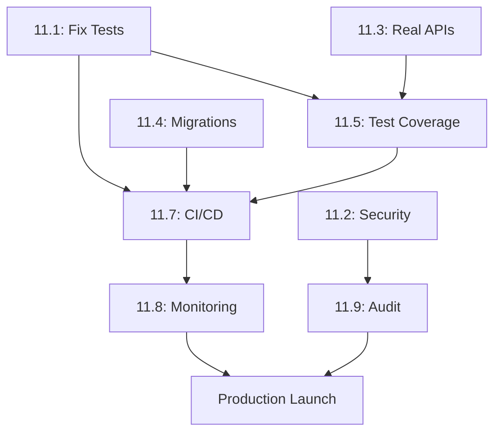

# Epic 11: Production Readiness - Story Summary

## Quick Reference

**Epic Status**: Ready for Immediate Development
**Total Story Points**: 89 points
**Estimated Duration**: 3-4 weeks
**Priority**: CRITICAL - Deployment Blockers

---

## Stories by Priority

### 🔴 CRITICAL - Must Fix Immediately (Week 1)

| Story | Title | Points | Days | Status |
|-------|-------|--------|------|--------|
| **11.1** | Fix Broken Test Suite | 5 | 1 | Ready |
| **11.2** | Remove Security Vulnerabilities | 3 | 1 | Ready |
| **11.3** | Connect Frontend to Real APIs | 8 | 2 | Ready |

**Week 1 Goal**: Remove all deployment blockers
**Total**: 16 points

---

### 🟡 HIGH - Fix This Week (Week 2)

| Story | Title | Points | Days | Status |
|-------|-------|--------|------|--------|
| **11.4** | Implement Database Migrations | 13 | 2-3 | Ready |
| **11.5** | Add Comprehensive Test Coverage | 21 | 4-5 | Ready |
| **11.6** | Remove Technical Debt | 8 | 1-2 | Planned |

**Week 2 Goal**: Build production-ready foundation
**Total**: 42 points

---

### 🟢 MEDIUM - Fix This Month (Week 3-4)

| Story | Title | Points | Days | Status |
|-------|-------|--------|------|--------|
| **11.7** | Set Up CI/CD Pipeline | 13 | 2-3 | Planned |
| **11.8** | Implement Monitoring & Observability | 8 | 2 | Planned |
| **11.9** | Security Audit & Hardening | 5 | 1 | Planned |

**Week 3-4 Goal**: Enable continuous deployment
**Total**: 26 points

---

### ⚪ LOW - Future Improvements (Phase 2)

| Story | Title | Points | Days | Status |
|-------|-------|--------|------|--------|
| **11.10** | Code Quality Improvements | 3 | 1 | Planned |
| **11.11** | Performance Optimization | 5 | 1 | Planned |

**Phase 2 Goal**: Excellence and optimization
**Total**: 8 points

---

## Week-by-Week Execution Plan

### Week 1: Remove Deployment Blockers (16 pts)

**Monday**
- [ ] Story 11.1: Fix Broken Test Suite (morning)
- [ ] Story 11.2: Remove Security Vulnerabilities (afternoon)

**Tuesday-Wednesday**
- [ ] Story 11.3: Connect Frontend to Real APIs (2 days)

**Thursday**
- [ ] Integration testing
- [ ] Verify all critical issues resolved

**Friday**
- [ ] Code review and documentation
- [ ] Deploy to staging environment

**Exit Criteria**:
✅ All tests passing
✅ No security vulnerabilities
✅ Dashboards using real data

---

### Week 2: Production Foundation (42 pts)

**Monday-Tuesday**
- [ ] Story 11.4: Database Migration System

**Wednesday-Friday** (overlap with Week 3)
- [ ] Story 11.5: Test Coverage (start)
  - Commission calculations
  - Authentication flows
  - API endpoints

**Exit Criteria**:
✅ Migration system working
✅ 60%+ test coverage
✅ Business logic fully tested

---

### Week 3: Automation & Monitoring (26 pts)

**Monday-Tuesday**
- [ ] Story 11.5: Test Coverage (finish)
- [ ] Story 11.6: Remove Technical Debt

**Wednesday-Thursday**
- [ ] Story 11.7: CI/CD Pipeline Setup

**Friday**
- [ ] Story 11.8: Monitoring Implementation

**Exit Criteria**:
✅ Automated deployment working
✅ Production monitoring active

---

### Week 4: Security & Launch Prep

**Monday**
- [ ] Story 11.9: Security Audit

**Tuesday-Friday**
- [ ] Production deployment preparation
- [ ] Load testing
- [ ] Final QA verification
- [ ] Launch readiness review

---

## Critical Dependencies



**Critical Path**: 11.1 → 11.3 → 11.5 → 11.7 → 11.8 → Production

---

## Success Metrics

### Quality Metrics
- ✅ Test suite: 100% passing
- ✅ Test coverage: >60% overall, >80% business logic
- ✅ Security: 0 critical/high vulnerabilities
- ✅ Technical debt: 0 "TEMPORARY" comments

### Process Metrics
- ✅ Build success rate: >95%
- ✅ Deployment time: <10 minutes
- ✅ Bug detection: 90% caught before production
- ✅ Fix ratio: <20% (currently 50%)

### Business Metrics
- ✅ Zero commission calculation errors
- ✅ Zero authentication breaches
- ✅ Zero data loss incidents
- ✅ Production launch ready in 3 weeks

---

## Story Files

All stories are located in: `docs/stories/`

- [11.1-fix-broken-test-suite.story.md](11.1-fix-broken-test-suite.story.md)
- [11.2-remove-security-vulnerabilities.story.md](11.2-remove-security-vulnerabilities.story.md)
- [11.3-connect-frontend-to-real-apis.story.md](11.3-connect-frontend-to-real-apis.story.md)
- [11.4-implement-database-migrations.story.md](11.4-implement-database-migrations.story.md)
- [11.5-comprehensive-test-coverage.story.md](11.5-comprehensive-test-coverage.story.md)
- 11.6-11.11: To be created

Epic documentation: `docs/epics/epic-11-production-readiness-technical-debt.md`

---

## Quick Start

### For Product Owner
```bash
# Review epic and prioritize stories
cat docs/epics/epic-11-production-readiness-technical-debt.md

# Plan sprint
# - Week 1: Stories 11.1, 11.2, 11.3 (16 points)
# - Week 2: Stories 11.4, 11.5, 11.6 (42 points)
```

### For Developers
```bash
# Start with Story 11.1 (highest priority)
cat docs/stories/11.1-fix-broken-test-suite.story.md

# Implement fix
# Run tests
npm run test

# Move to Story 11.2
cat docs/stories/11.2-remove-security-vulnerabilities.story.md
```

---

## Risk Summary

### High Risk Items
1. **Test writing time underestimated** (40% probability)
   - Mitigation: Start with highest-value tests
   - Accept 60% coverage as MVP (not 80%)

2. **Breaking changes during refactoring** (30% probability)
   - Mitigation: Write tests BEFORE refactoring
   - Use feature flags for risky changes

3. **API response structure mismatches** (60% probability)
   - Mitigation: Validate with TypeScript + Zod
   - Test with actual database data early

### Medium Risk Items
- Database migration complexity
- Performance issues with real data
- Team velocity slower than estimated

---

## Communication Plan

### Daily Standup Focus
- Which story are you working on?
- Any blockers?
- Tests passing?
- Coverage increasing?

### Weekly Demo
- Show working features with real data
- Demonstrate test coverage improvements
- Review security improvements

### Sprint Review
- Week 1: Deployment blockers removed ✅
- Week 2: Production foundation complete ✅
- Week 3: Automation working ✅
- Week 4: Launch readiness ✅

---

## Resources

### Documentation
- [Epic 11 Full Documentation](../epics/epic-11-production-readiness-technical-debt.md)
- [Testing Strategy](../architecture/testing-strategy.md)
- [Security Guidelines](../architecture/security-and-performance.md)
- [CI/CD Setup](../architecture/deployment-architecture.md)

### Tools & Libraries
- **Testing**: Jest, Playwright, Supertest
- **Migrations**: node-pg-migrate
- **Mocking**: MSW (Mock Service Worker)
- **Coverage**: Istanbul/NYC
- **Security**: npm audit, Snyk
- **CI/CD**: GitHub Actions

---

## Getting Help

### Questions About:
- **Epic/Stories**: Review epic documentation or ask PO
- **Testing**: See testing-strategy.md or pair program
- **Security**: See security guidelines or request code review
- **Migrations**: See database migration docs

### Blockers:
1. Document blocker in story comments
2. Raise in daily standup
3. Escalate to tech lead if blocking >1 day

---

**Created**: 2025-10-18
**Last Updated**: 2025-10-18
**Next Review**: Start of Week 1 Sprint

**Ready to Start**: ✅ YES - Begin with Story 11.1 immediately